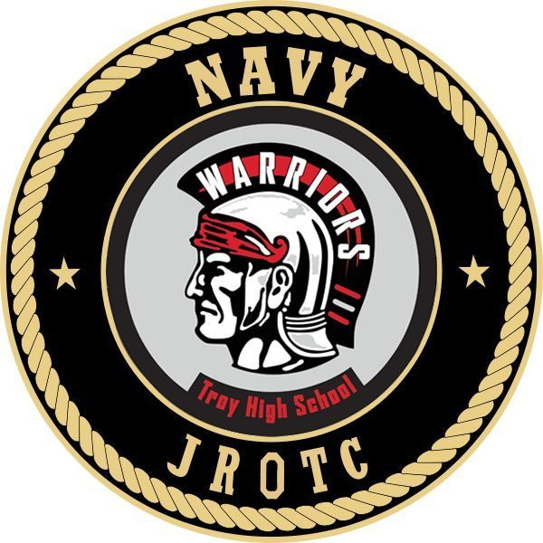

# CLAUDE.md

This file provides guidance to Claude Code (claude.ai/code) when working with code in this repository.

## Project Overview

This is a static website for the Troy High School VEX Robotics program. The site showcases the robotics teams, sponsors, events, and program information.

## Project Structure

- **Static HTML/CSS Website**: No build system, package manager, or JavaScript framework
- **Single CSS file**: `styles.css` contains all styling (11,867 bytes)
- **14 HTML pages** organized into:
  - **Home/About**: `index.html` (home), `about.html` (detailed about)
  - **Teams**: `teams.html` (overview) + 7 individual team pages (`teama.html` through `teamy.html`)
  - **Program pages**: `sponsors.html`, `events.html`, `awards.html`, `contact.html`
- **Image assets**: Team photos (`teama-photo.jpg`, etc.), logos (`NJROTC.jpg`, `troyvexlogo.jpg`)

## Development

### Running the Website Locally

**IMPORTANT**: Do NOT use `localhost` or simple `file://` URLs. The site uses extensionless URLs (`href="about"` instead of `href="about.html"`) which require a proper static file server.

**Recommended method using npx:**
```bash
npx serve . --single
```

**Alternative methods:**
```bash
# Using Python 3
python -m http.server 3000

# Using Node's http-server
npx http-server -p 3000 --ext html

# Using PHP
php -S localhost:3000
```

Then open `http://localhost:3000` in your browser.

The `--single` flag (or equivalent) is important for handling the extensionless URLs correctly.

### File Organization
- **Template-based structure**: All pages share identical navigation header (lines 11-36 in each HTML file)
- **Navigation pattern**: Fixed header with logo, dropdown menu for teams, and consistent page links
- **Responsive design**: Mobile-first CSS with media queries in `styles.css`
- **Color scheme**: Black/white theme with red accents (#b12a34 for highlights)
- **Typography**: Google Fonts 'Geist' family throughout

### CSS Architecture
- **Mobile-first**: Media queries at 768px and 1024px breakpoints
- **Layout systems**: Flexbox for navigation, Grid for content sections
- **Component classes**: `.hero`, `.team-card`, `.sponsor-level`, `.event-card`, `.page-header`
- **Navigation components**: `.navbar`, `.nav-links`, `.dropdown`, `.dropdown-menu`
- **Consistent spacing**: `rem`-based spacing system with `1rem = 16px` base

## Page Architecture

### Navigation Template (present in all HTML files)
```html
<header>
    <nav class="navbar">
        <div class="logo-container">
            <a href="/"></a>
            <span class="logo-text" style="font-size:2rem;">Troy VEX Robotics</span>
        </div>
        <ul class="nav-links">
            <li><a href="about">About</a></li>
            <li class="dropdown">
                <a href="teams">Teams</a>
                <ul class="dropdown-menu">
                    <li><a href="teams">Our Teams</a></li>
                    <li><a href="teama">Team A - Aegis</a></li>
                    <li><a href="teamb">Team B - Ouroboros</a></li>
                    <li><a href="teamc">Team C - Jinx</a></li>
                    <li><a href="teamd">Team D - Nyx</a></li>
                    <li><a href="teame">Team E - Eclipse</a></li>
                    <li><a href="teamx">Team X - Paradox</a></li>
                    <li><a href="teamy">Team Y - Atlantis</a></li>
                </ul>
            </li>
            <li><a href="sponsors">Sponsors</a></li>
            <li class="dropdown">
                <a href="events">Events</a>
                <ul class="dropdown-menu">
                    <li><a href="events">Event List</a></li>
                    <li><a href="gallery">Gallery</a></li>
                </ul>
            </li>
            <li><a href="awards">Awards</a></li>
            <li><a href="donate">Donate</a></li>
        </ul>
    </nav>
</header>
```

### Content Section Patterns
- **Hero sections**: `.hero` class with centered content
- **Team cards**: `.team-card` in grid layout on `teams.html`
- **Team detail pages**: `.team-details` with `.team-info-section`
- **Sponsor tiers**: `.platinum`, `.gold`, `.silver` classes with distinct styling
- **Event cards**: `.event-card` with date and location info

## Common Development Tasks

### Adding New Content
- **New team page**: Copy `teama.html` structure, update team-specific content
- **New team card**: Copy `.team-card` div in `teams.html`, update links and info
- **New sponsor**: Add to appropriate tier section in `sponsors.html`
- **New event**: Copy `.event-card` structure in `events.html`
- **Navigation updates**: Must be updated in all 14 HTML files (lines 17-34)

### Styling Updates
- **All styling**: Modify `styles.css` - no other CSS files exist
- **Component styling**: Search for class names (`.team-card`, `.sponsor-level`, etc.)
- **Responsive adjustments**: Media queries at bottom of `styles.css`
- **Color changes**: Update CSS custom properties or direct color values

### Maintenance Notes
- **Navigation consistency**: Any header/nav changes must be replicated across all 14 HTML files
- **Image management**: Team photos are 243,268 bytes each, logos in root directory
- **No build process**: Direct file editing only, no compilation or bundling
- **Browser testing**: Test responsive behavior at mobile (≤768px), tablet (769-1024px), desktop (≥1025px)

## Technical Notes

- **No JavaScript**: Pure HTML/CSS implementation (except `darkmode.js`)
- **No package.json**: Empty `package-lock.json` exists but no dependencies
- **No build tools**: No webpack, vite, or other build configuration
- **No frameworks**: No React, Vue, or other JavaScript frameworks
- **Extensionless URLs**: Links use `href="about"` not `href="about.html"` (requires server config)
- **Deployment**: Copy all files to any web server or static hosting service
- **Git**: Repository tracks all source files directly
